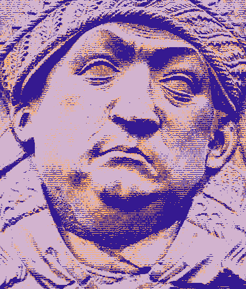
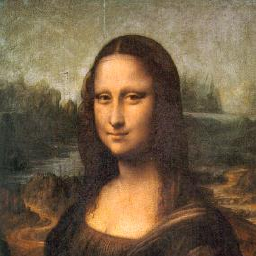

#### <p align="center">Hide secret files inside a PNG of your choice without anyone noticing </p>

<p align="center">
  
</p>

<p align="center">
  <a href="LICENSE">
    
  </a>
</p>


# Steganography-Trithemius

Welcome to Trithemius.py, an Steganography tool to hide any type of file inside a PNG image of your choice! Its works by enconding the file bits inside the bit planes of the input image color channels. Encodes and Decodes blazingly fast by using code vectorization :D

## Example of Usage

| secret_message.txt | input_image.png | encoded_image.png |
|-----------|-----------| -----------|
| I am already far north of London, and as I walk in the streets of Petersburgh, I feel a cold northern breeze play upon my cheeks, which braces my nerves and fills me with delight. Do you understand this feeling?...|  |  |


## Code Structure

    Trithemius /
    │
    ├── src/
    │   ├── banner.txt
    │   ├── my_bits.py
    │   ├── my_cv.py
    │   ├── my_cli.py
    │   ├── my_files_io.py
    │   ├── encode.py
    │   ├── decode.py
    │   └── inspect.py
    │
    ├── app.py
    └── unit_tests.py

## Features

- **Encoding**:   Hide files within PNG images using specified bit planes.
- **Decoding**:   Extract hidden files from encoded PNG images.
- **Inspecting**: Visualize bit planes of color channels for image analysis.

- **Open Source**: Free as in beer and free as in speech.
- **Cross-Platform**: Works on Windows, Linux, and macOS (its just python)
- **Command-Line Interface**: Offers a user friendly interface with commands checks. 

## But how does it work ?

It uses the LSB steganography technique!

The least significant bit (LSB) steganography in color images is a technique that hides information within an image by altering theleast important bits of its pixels. Each pixel in a color image typically consists of 24 bits, divided into 8 bit planes for each color channel (red, green, and blue).

For example, if a pixel has an RGB value of (245, 33, 74), its binary representation will be:

R: 11110101 
G: 00100001
B: 01001010  

The least significant bit belongs to bit plane 0, i.e., the first bit read from right to left, while the most significant bit belongs to bit plane 7. If we wish to hide the binary information represented by 101, we can alter the bit planes of our pixel so that its new value is as follows:

R: 11110101
G: 00100000
B: 01001011

This translates to an RGB value of (245, 32, 75), an imperceptible color change to the human eye. With this idea, we can practically store arbitrary information in a large enough image, simply by choosing which bit planes to alter.

## Installation

1. Clone the repository:
   ```sh
   git clone https://github.com/your-username/trithemius.py.git
